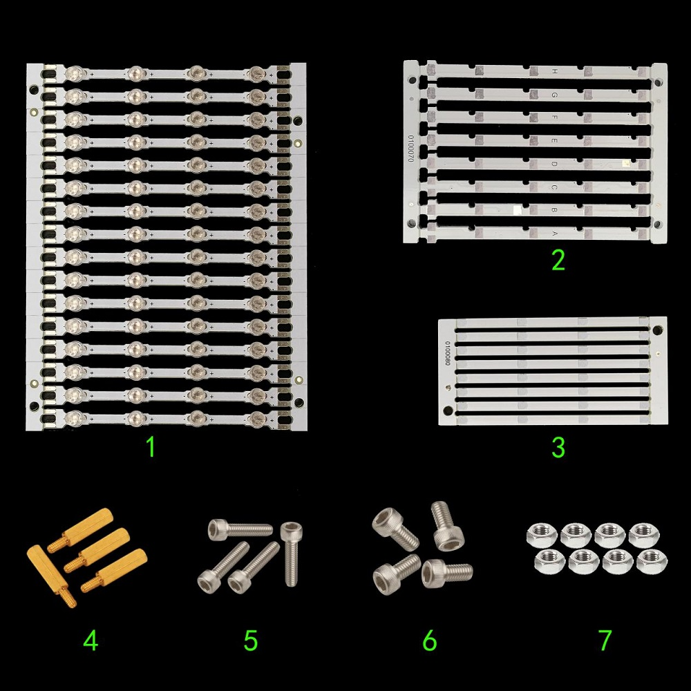
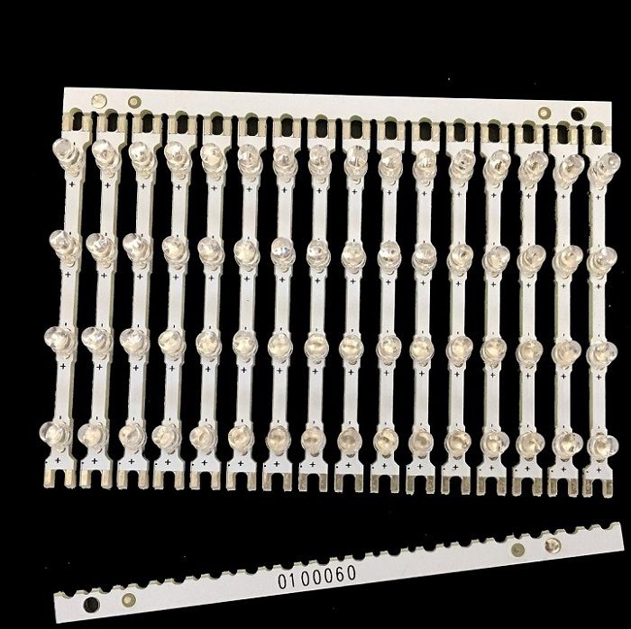
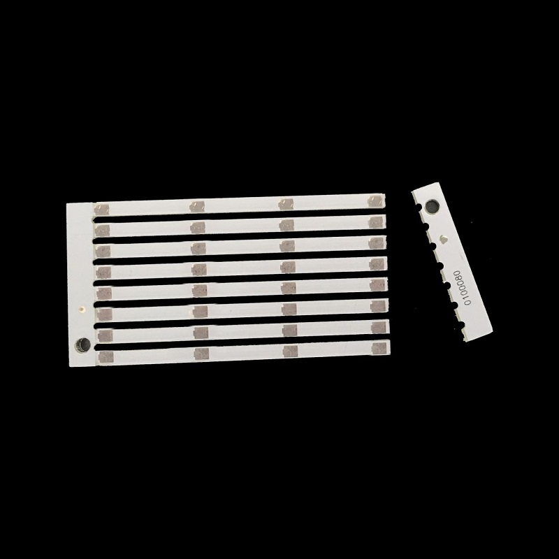
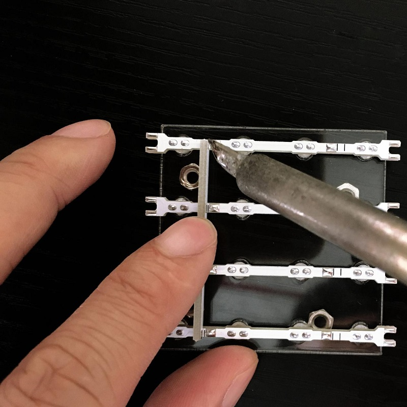
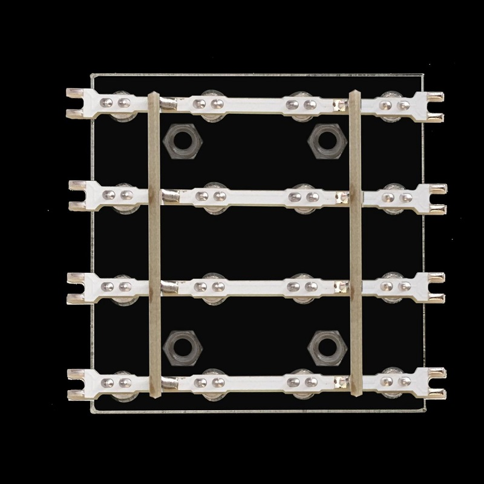
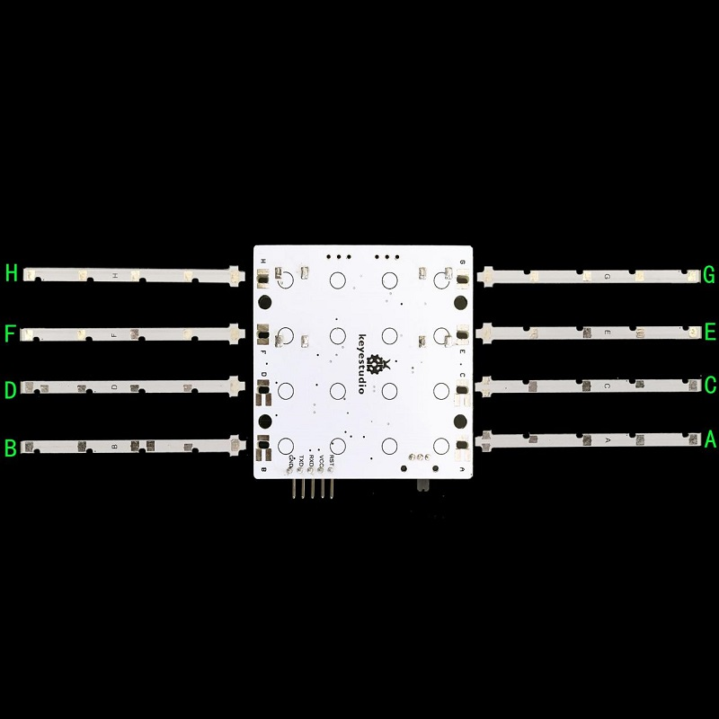
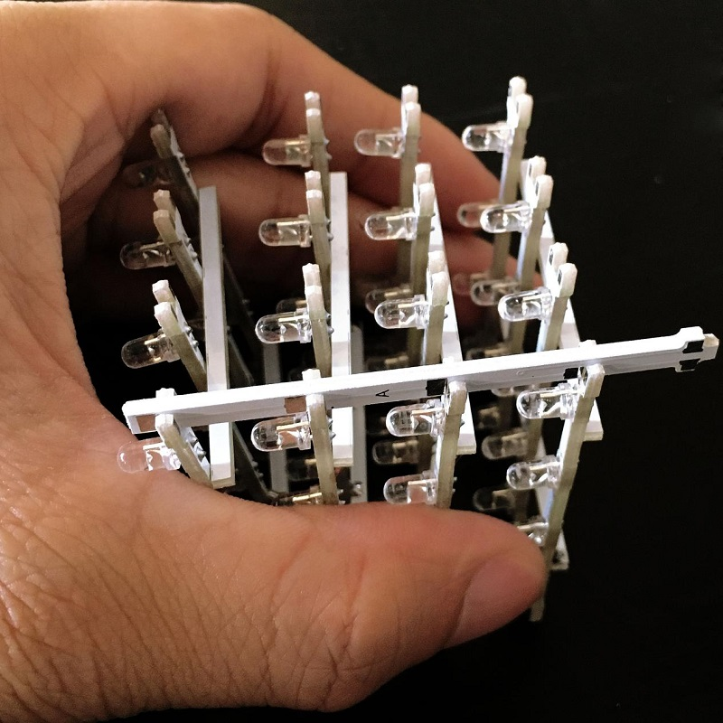
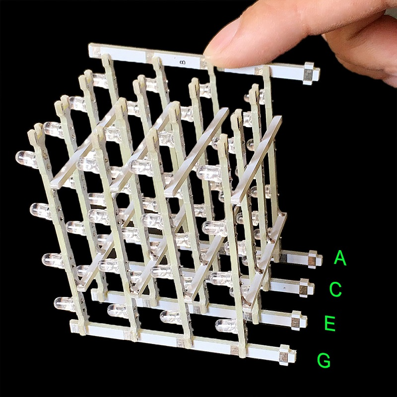
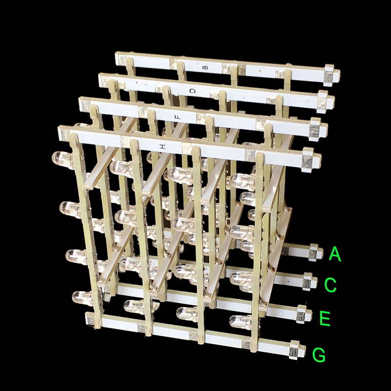
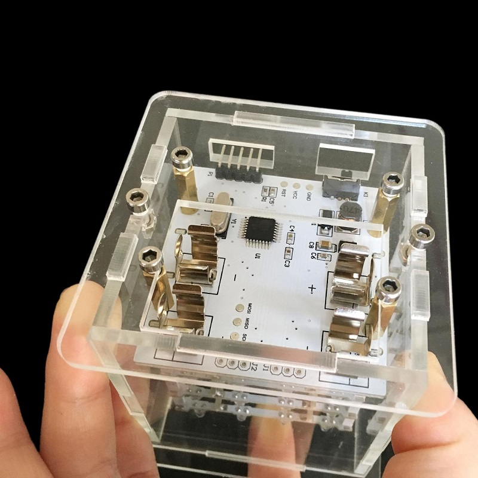

# KS0182 4x4x4 LED Cube Kit with Arduino

##  **1.Introduction**

For ARDUINO starters, we’d love to do projects that would blow people’s mind
off. But without certain basic knowledge of electronics, we may find it
difficult to do complicated projects such as robots, 3D printers etc. This 4x4x4
LED Cube kit we developed is no doubt your best choice.

So what is LED Cube? Well, by the name of it, we can tell it may be a light
emitting cube. We use 64 LEDs to solder a 4\*4\*4 3D-matrix. Each face of the
cube or should we say each dot of the cube will emit beautiful light.

This 3D LED cube is based on ARDUINO, an open-source environment. So it also has
features of open-source and easy-to-use. Even for enthusiasts without solid
electronic knowledge, you can make projects that are going to amaze others!

##  **2.Features**

• Adopts 64 blue LEDs

• working voltage: 5V

• working current: 150MA

• power input with built-in voltage step-up circuit

• compatible with ARDUINO open-source hardware

• comes with animations program

• Simple assembly using a PCB frame

• can work off-line (doesn’t require a computer after program is uploaded)

## **3. Part list**

1 Control panel (1 PCS)

2 Soldering jig (1 PCS)

3 Acrylic chassis (1 PCS)

4 Acrylic crown sheet (1 PCS)

5、6、7、8 Acrylic side plate ，then No. 6 and 8 is the same (4 PCS in total)

1 Stand horizontal plate(16 PCS)

2 Stand upright column board (8 PCS)

3 Horizontal holder board (8 PCS)

4 Copper bush (4 PCS)

5 3\*10 inner-hexagon screw（4 PCS）

6 3\*6 inner-hexagon screw（4 PCS）

7 3M nut（4 PCS）

\*\*\*\*\*\*\*\*\*\*\*\*\*\*\*\*\*\*\*\*\*\*\*\*\*\*\*\*\*\*\*\*\*\*\*\*\*\*\*\*\*\*\*\*\*\*\*\*\*\*\*\*\*\*\*\*\*\*\*\*\*\*\*\*\*\*\*\*\*\*\*\*\*\*\*\*\*\*

Self-prepare tools：

Soldering iron, Tinny line, Inner-hexagon tool

**Step by step soldering instructions:**

1、Solder the stand horizontal plates.

Unpick the stand horizontal plates as shown above.

Unpick the horizontal holder boards following the previous step.

Set four nuts in in the kit as shown above，then put four stand horizontal
plates on the soldering jig，and black lines on the stand horizontal plates aims
to indicate the place of subsequent soldering holder boards.

Place the soldering jig on four nuts, and then put two horizontal holder board
on the stand horizontal plate between black line（Notice: the solder point of 4
plane PCB strips should be close to solder point of fixing strip) , and finally
add tin to fix them on eight welding spots by soldering iron.

Stand soldered by eight welding spots above.

Continuously solder four stands as above steps.

3、Install upright stand.

Every upright has its own place and can’t be installed mistakenly, so before
installing confirm the place of every upright. As shown above , Upright A must
be inserted in the aperture on the Chassis A, and Upright B must be inserted in
the aperture on the Chassis B. Continue like this until eight uprights are
inserted in the aperture of corresponding letters on the chassis.

As shown above , place properly four horizontal plates in the same direction,
and install Upright A on the gap. Don’t add tin to solder after installing.

As shown above , install respectively Upright C, E, G according to the previous
step.

As shown above , install Upright B on the gap. Don’t add tin to solder after
installing.

As shown above , install respectively Upright D,F, H according to the previous
step.

Tighten four copper bushes in the control board by using four 3M nuts.

After the stand inserted the chassis, adjust them to be vertical.

According to last step, add tin to solder the bonding pad between horizontal
stand and upright by soldering iron. If there is bonding pad on horizontal stand
but not on upright, don’t need to add tin to solder.

After soldering all bonding pads, please check carefully whether there are
welding spots lacking tin. Welded finished product as shown above.

As shown above, fix four copper bushes on Acrylic chassis by four3\*6
inner-hexagon screws.

Install four Acrylic side plates in the slot of Acrylic chassis.

Notice: the holes of acrylic side boards are aligned with the corresponding
positions of control board.

Next, install Acrylic crown sheet according to slots.

After installing , upset it according to above picture, and then lock tightly
Acrylic chassis with Acrylic side plate by using two 3\*10 inner-hexagon screws
and two 3M nuts.

\-

As shown above, a tightening chassis.

Then tighten the screws of Acrylic crown sheet, and as shown above, it is the
finished product after installing.

## **4. Program**

### **1. Wiring:**

| Control board  | Arduino FTDI basic program downloader |
|----------------|---------------------------------------|
| VCC            | 5V                                    |
| GND            | GND                                   |
| RST            | DTR                                   |
| TXD            | RXD                                   |
| RXD            | TXD                                   |

### **2.Connection diagram:**

### 3.Upload Program Method

  Set control board type

  Set the port

  Set this step by default

 After setting well, click  to
    upload program.

### **4.Sample code:**

    \#include \<avr/pgmspace.h\>

    \#define CUBESIZE 4

    \#define PLANESIZE CUBESIZE\*CUBESIZE

    \#define PLANETIME 3333

    \#define TIMECONST 20

    prog_uchar PROGMEM PatternTable[] = {

    //////////生成动画的代码粘贴到这里面////////////////////

    B0001,B0000,B0000,B0000,B0001,B0000,B0000,B0000,B0000,B0000,B0000,B0000,B0000,B0000,B0000,B0000,10,

    B0011,B0000,B0000,B0000,B0011,B0000,B0000,B0000,B0000,B0000,B0000,B0000,B0000,B0000,B0000,B0000,10,

    B0011,B0010,B0000,B0000,B0011,B0010,B0000,B0000,B0000,B0000,B0000,B0000,B0000,B0000,B0000,B0000,10,

    B0011,B0011,B0000,B0000,B0011,B0011,B0000,B0000,B0000,B0000,B0000,B0000,B0000,B0000,B0000,B0000,10,

    B0110,B0110,B0000,B0000,B0110,B0110,B0000,B0000,B0000,B0000,B0000,B0000,B0000,B0000,B0000,B0000,10,

    B0000,B0000,B0000,B0000,B0110,B0110,B0000,B0000,B0110,B0110,B0000,B0000,B0000,B0000,B0000,B0000,10,

    B0000,B0000,B0000,B0000,B0000,B0110,B0110,B0000,B0000,B0110,B0110,B0000,B0000,B0000,B0000,B0000,10,

    B0000,B0000,B0000,B0000,B0000,B0000,B0110,B0110,B0000,B0000,B0110,B0110,B0000,B0000,B0000,B0000,10,

    B0000,B0000,B0000,B0000,B0000,B0000,B0011,B0011,B0000,B0000,B0011,B0011,B0000,B0000,B0000,B0000,10,

    B0000,B0000,B0000,B0000,B0000,B0001,B0011,B0111,B0000,B0001,B0011,B0111,B0000,B0000,B0001,B0011,10,

    B0000,B0000,B0000,B0000,B0000,B0011,B0111,B0111,B0000,B0011,B0111,B0111,B0000,B0001,B0011,B0111,10,

    B0000,B0000,B0000,B0000,B0000,B0111,B0111,B0111,B0000,B0111,B0111,B0111,B0000,B0011,B0111,B0111,10,

    B0000,B0000,B0000,B0000,B0000,B0111,B0111,B0111,B0000,B0111,B0111,B0111,B0000,B0111,B0111,B0111,10,

    B0000,B0000,B0000,B0000,B0000,B1110,B1110,B1110,B0000,B1110,B1110,B1110,B0000,B1110,B1110,B1110,10,

    B0000,B1110,B1110,B1110,B0000,B1110,B1110,B1110,B0000,B1110,B1110,B1110,B0000,B0000,B0000,B0000,10,

    B0000,B1110,B1110,B1110,B0000,B1110,B1110,B1110,B0000,B1100,B1110,B1110,B0000,B0000,B0000,B0000,10,

    B0000,B1110,B1110,B1110,B0000,B1100,B1110,B1110,B0000,B1000,B1100,B1110,B0000,B0000,B0000,B0000,10,

    B0000,B1100,B1110,B1110,B0000,B1000,B1100,B1110,B0000,B0000,B1000,B1100,B0000,B0000,B0000,B0000,10,

    B0000,B1000,B1100,B1110,B0000,B0000,B1000,B1100,B0000,B0000,B0000,B1000,B0000,B0000,B0000,B0000,10,

    B0000,B0000,B1000,B1100,B0000,B0000,B0000,B1000,B0000,B0000,B0000,B0000,B0000,B0000,B0000,B0000,10,

    B0000,B0000,B0000,B1000,B0000,B0000,B0000,B0000,B0000,B0000,B0000,B0000,B0000,B0000,B0000,B0000,10,

    B0000,B0000,B1000,B1000,B0000,B0000,B0000,B0000,B0000,B0000,B0000,B0000,B0000,B0000,B0000,B0000,10,

    B0000,B1000,B1000,B1000,B0000,B0000,B0000,B0000,B0000,B0000,B0000,B0000,B0000,B0000,B0000,B0000,10,

    B1000,B1000,B1000,B1000,B0000,B0000,B0000,B0000,B0000,B0000,B0000,B0000,B0000,B0000,B0000,B0000,10,

    B1100,B1000,B1000,B0000,B0000,B0000,B0000,B0000,B0000,B0000,B0000,B0000,B0000,B0000,B0000,B0000,10,

    B1110,B1000,B0000,B0000,B0000,B0000,B0000,B0000,B0000,B0000,B0000,B0000,B0000,B0000,B0000,B0000,10,

    B1110,B0000,B0000,B0000,B0010,B0000,B0000,B0000,B0000,B0000,B0000,B0000,B0000,B0000,B0000,B0000,10,

    B0000, B0000, B0000, B0000, B0000, B0000, B0000, B0000, B0000, B0000, B0000,
    B0000, B0000, B0000, B0000, B0000, 0

    };

    int LEDPin[] = {0, 1, 2, 3, 4, 5, 6, 7, 8, 9, 10, 11, 12, 13, A0, A1};

    int PlanePin[] = {A2, A3, A4, A5};

    void setup()

    {

    int pin;

    for (pin=0; pin\<PLANESIZE; pin++) {

    pinMode( LEDPin[pin], OUTPUT );

    }

    for (pin=0; pin\<CUBESIZE; pin++) {

    pinMode( PlanePin[pin], OUTPUT );

    }

    }

    void loop()

    {

    byte PatternBuf[PLANESIZE];

    int PatternIdx;

    byte DisplayTime;

    unsigned long EndTime;

    int plane;

    int patbufidx;

    int ledrow;

    int ledcol;

    int ledpin;

    PatternIdx = 0;

    do {

    memcpy_P( PatternBuf, PatternTable+PatternIdx, PLANESIZE );

    PatternIdx += PLANESIZE;

    DisplayTime = pgm_read_byte_near( PatternTable + PatternIdx++ );

    EndTime = millis() + ((unsigned long) DisplayTime) \* TIMECONST;

    while ( millis() \< EndTime ) {

    patbufidx = 0;

    for (plane=0; plane\<CUBESIZE; plane++) {

    if (plane==0) {

    digitalWrite( PlanePin[CUBESIZE-1], HIGH );

    } else {

    digitalWrite( PlanePin[plane-1], HIGH );

    }

    ledpin = 0;

    for (ledrow=0; ledrow\<CUBESIZE; ledrow++) {

    for (ledcol=0; ledcol\<CUBESIZE; ledcol++) {

    digitalWrite( LEDPin[ledpin++], PatternBuf[patbufidx] & (1 \<\< ledcol) );

    }

    patbufidx++;

    }

    digitalWrite( PlanePin[plane], LOW );

    delayMicroseconds( PLANETIME );

    }

    }

    } while (DisplayTime \> 0);

    }

After program is uploaded, with power on , you can see the beautiful light
effect.

**5. Links for resources needed for the project:**

ARTDUINO software download address: <https://www.arduino.cc/en/Main/Software>
(The version we tested was Arduino 1.5.6, new version may be not compatible,
such as Arduino1.8.10)

Project code address:

<http://7326097.s21d-7.faiusrd.com/0/ABUIABAAGAAg3eL-ugUot5fxpQU?f=CUBE4+CODE.rar&v=1465905453>

<http://www.instructables.com/id/4x4x4-LED-Cube-Arduino-Uno/>

<http://www.instructables.com/id/The-4x4x4-LED-cube-Arduino/>

<http://www.makeuseof.com/tag/how-to-make-a-pulsating-arduino-led-cube-that-looks-like-it-came-from-the-future/>
